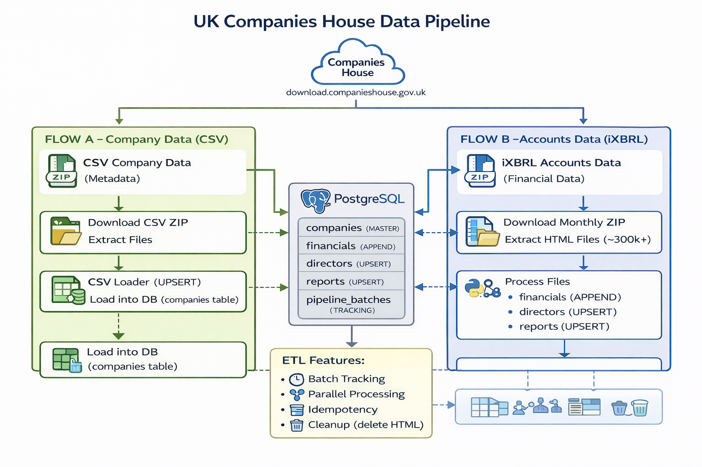

# UK Companies House Data Pipeline

## 📌 Overview

This project builds a scalable **data engineering pipeline** to process UK Companies House data from two sources:

1. **Accounts Data (iXBRL HTML files)** – Financials, Directors, Reports
2. **Company Data (CSV)** – Official company metadata

The pipeline extracts, transforms, and loads this data into a **PostgreSQL database** using parallel processing.
---
## 📌 Project Summary

### ❓ Why
- Build a real-world data pipeline  
- Handle large-scale data (300k+ files)  
- Practice database design + ETL pipeline concepts  

---

### 🎯 What
A complete end-to-end data pipeline that:

- Extracts data from **Companies House**
- Processes it
- Stores it in a **PostgreSQL database** for further use/analysis  

---

### 🔄 Data Sources

#### 1) iXBRL Files (Accounts Data)
`https://download.companieshouse.gov.uk/en_monthlyaccountsdata.html`

Used February 2026 batch file(Accounts_Monthly_Data-February2026.zip ~1.8 GB):
in `congig.py` `ACCOUNTS_ZIP_FILENAME = "Accounts_Monthly_Data-February2026.zip"`

Where YYMM is the batch year+month (2602 = Feb 2026), CCCCCCCC is the company number (8
digits with leading zeros), and DDDDDDDD is the accounts date.


- Contains financial data (revenue, profit, assets, etc.)
- Processed using provided `test_pipeline.py` (parser)

**Steps:**
1. Download files (monthly ZIP)
2. Extract HTML files
3. Run parser on each file
4. Store parsed results in database (financials, directors, reports)
5. Validate output with provided sample results

---

#### 2) CSV Data (Company Metadata) - Free Company Data Product (CSV)
`https://download.companieshouse.gov.uk/en_output.html`
 All live companies on the register, provided as multiple CSV ZIP files
 Handled data ingestion for this in `flow_company_csv.py`   separate CSV loader
 
- Contains company information like:

  ```data
  "CompanyNumber": "company_number",
  "CompanyName": "company_name",
  "CompanyStatus": "company_status",
  "CompanyCategory": "company_type",
  "RegAddress.CareOf": "reg_address_care_of",
  "RegAddress.POBox": "reg_address_po_box",
  "RegAddress.AddressLine1": "reg_address_line1",
  "RegAddress.AddressLine2": "reg_address_line2",
  "RegAddress.PostTown": "reg_address_post_town",
  "RegAddress.County": "reg_address_county",
  "RegAddress.Country": "reg_address_country",
  "RegAddress.PostCode": "reg_address_postcode",
  "IncorporationDate": "incorporation_date",
  "DissolutionDate": "dissolution_date",
  "Accounts.NextDueDate": "accounts_next_due",
  "Accounts.LastMadeUpDate": "accounts_last_made_up",
  "Returns.NextDueDate": "returns_next_due",
  "Returns.LastMadeUpDate": "returns_last_made_up",
  "ConfirmationStatement.NextDueDate": "confirmation_next_due",
  "ConfirmationStatement.LastMadeUpDate": "confirmation_last_made",
  "SICCode.SicText_1": "sic_code_1",
  "SICCode.SicText_2": "sic_code_2",
  "SICCode.SicText_3": "sic_code_3",
  "SICCode.SicText_4": "sic_code_4",
  "CountryOfOrigin": "country_of_origin",
  "Accounts.AccountCategory": "accounts_type",
  "LegalForm": "legal_form"


**Important:**
- This data is **not extracted from the iXBRL parser**
- A **separate CSV loader** is required to process this dataset
- The CSV contains **authoritative company metadata** (name, address, SIC codes, status, etc.)
- iXBRL filings are **unreliable for metadata** (missing or inconsistent fields, especially in small filings)
- The CSV snapshot covers **all live companies**, not just those filing accounts
- This data acts as the **master reference table (companies)**
- Loaded using **UPSERT (full snapshot refresh)**

**Steps:**
1. Download CSV ZIP files
2. Extract data
3. Load into `companies` table

---


## 🚀 Setup & Installation (Run Locally)

### 1. Clone Repository
`git clone https://github.com/your-username/companies-house-pipeline.git`  
`cd companies-house-pipeline`

### 2. Create Virtual Environment
`python -m venv venv`  

#### Activate Environment  
`Windows: venv\Scripts\activate`  
`Mac/Linux: source venv/bin/activate`  

### 3. Install Dependencies
`pip install -r requirements.txt` 

### 4. Setup PostgreSQL Database
Create a database manually:
`CREATE DATABASE companies_house;`

### 5. Configure Environment Variables
Create a `.env` file in the root directory:

`DB_HOST=localhost  
DB_PORT=port
DB_NAME=companies_house  
DB_USER=user_name
DB_PASSWORD=your_password`  

### 6. Run Pipeline
`python run_pipeline.py`  
Piple line took almost 2 hours


## 📝 Notes
- Ensure PostgreSQL is running before starting  
- Update `.env` credentials based on your system  
- Large datasets may take time; adjust worker count in config.py if needed  


## 🏗️ Architecture

### 🔹 Flow A – Company Data (CSV)

* Download Companies House CSV
* Extract ZIP files
* Load into `companies` table
* Uses **UPSERT** (latest snapshot replaces old data)

### 🔹 Flow B – Accounts Data (iXBRL)

* Download monthly accounts ZIP
* Extract ~300k+ HTML files
* Process using `test_pipeline.py`
* Store output into:

  * `financials` (APPEND ONLY)
  * `directors` (UPSERT)
  * `reports` (UPSERT)
* Delete extracted files after processing





---

## 🗄️ Database Schema

### 1. companies

* Stores master company data (from CSV)
* **Strategy:** UPSERT

### 2. financials

* Stores financial metrics over time
* **Strategy:** APPEND ONLY

### 3. directors

* Stores latest directors per company
* **Strategy:** UPSERT

### 4. reports

* Stores narrative sections
* **Strategy:** UPSERT

### 5. pipeline_batches

* Tracks processed batches

---

## 🔑 Key Design Decisions

### ✔ Company Number

* Stored as `TEXT`
* Preserves leading zeros

### ✔ Write Strategies

| Table      | Strategy | Reason             |
| ---------- | -------- | ------------------ |
| financials | APPEND   | Time-series data   |
| directors  | UPSERT   | Only latest needed |
| reports    | UPSERT   | Only latest needed |
| companies  | UPSERT   | Full snapshot      |

### ✔ Indexing

* Index on `company_number` in all tables

### ✔ Tracking

* Batch tracking ensures:

  * No duplicate processing
  * Easy identification of latest data

---

## ⚙️ Pipeline Features

### 🔹 Parallel Processing

* Uses `multiprocessing.Pool`
* Configurable workers (default: 8)

### 🔹 Batch Inserts

* Inserts in chunks (e.g., 500 rows)

### 🔹 Idempotency

* Safe to re-run
* No duplicate data

### 🔹 Error Handling

* Failed files logged
* Pipeline continues execution

### 🔹 Cleanup

* HTML files deleted after processing
* ZIP files retained

---

## 📂 Project Structure

```
companies_house_financial/
│── data/
│── logs/
│── errors/
│── config.py
│── db.py
│── setup_db.py
│── run_pipeline.py
│── flow_company_csv.py
│── flow_accounts.py
│── test_pipeline.py
│── README.md
```

---

## ▶️ How to Run

### 1. Run Pipeline

```bash
python run_pipeline.py
```

---

## ✅ Verification Queries

### Check companies loaded

```sql
SELECT COUNT(*) FROM companies;
```

### Check financials

```sql
SELECT company_number, COUNT(*)
FROM financials
GROUP BY company_number
LIMIT 10;
```

### Latest batch

```sql
SELECT * FROM pipeline_batches
ORDER BY created_at DESC
LIMIT 1;
```

---

## 🔄 Batch Tracking

Tracks:

* batch_name (Feb-26)
* status (completed/failed)
* processed files
* failed files

Ensures:

* No reprocessing
* Always know latest data

---

## 🚀 Future Improvements

* Cron job/orchestration for automation
* Security checks
* Auto-detect new batches (It will do this but currently used hard-coded line we only need to pass variable)
* Cloud storage (S3)
* Data quality checks

---

## 🧠 Trade-offs

| Decision          | Reason                          |
| ----------------- | ------------------------------- |
| Multiprocessing   | Faster processing of 300k files |
| Batch inserts     | Avoid DB overload               |
| UPSERT strategy   | Keeps latest clean data         |
| Append financials | Required for analytics          |

---

## 📊 Conclusion

This pipeline is:

* Scalable
* Fault-tolerant
* Production-ready

Designed to handle large-scale financial data ingestion efficiently.
